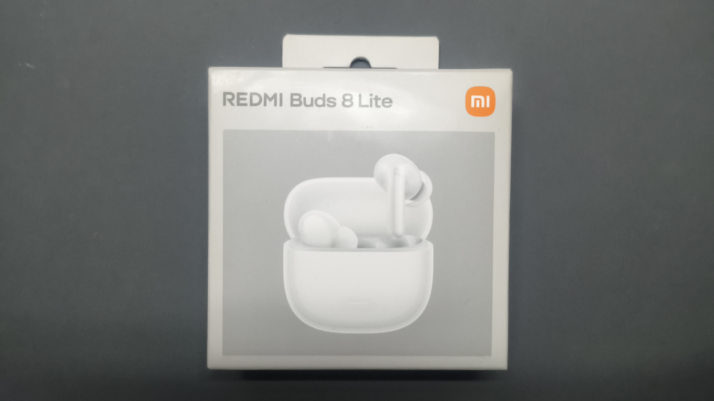
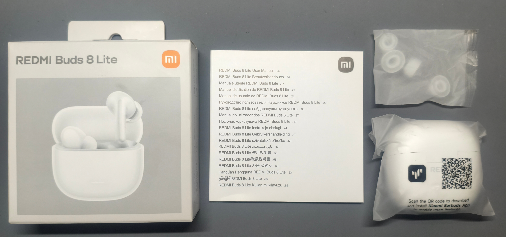
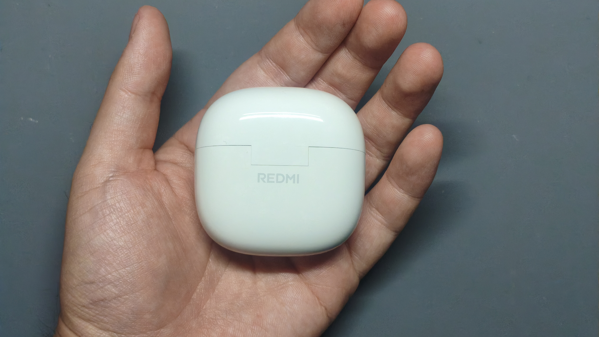
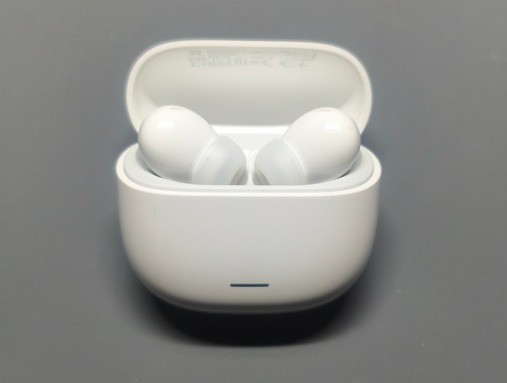
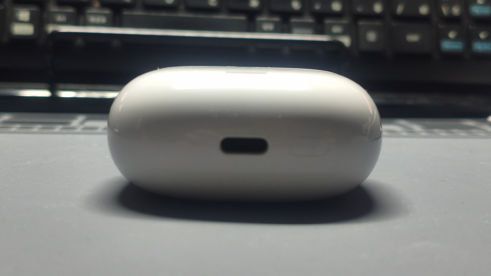

import Note from '@/components/blog/Note.astro';
import Details from '@/components/blog/Details.astro';
import RakutenAffiliate from '@/components/blog/RakutenAffiliate.astro';

export const redmiBuds8LiteHtml = `<table border="0" cellpadding="0" cellspacing="0"><tr><td>
<table><tr><td style="width:100px"></td><td style="vertical-align:top;display: block;">
<a href="https://hb.afl.rakuten.co.jp/ichiba/52a5b4c8.6c2c1630.52a5b4c9.cedf74bd/?pc=https%3A%2F%2Fitem.rakuten.co.jp%2Fxiaomiofficial%2Fm71620%2F&link_type=picttext&ut=eyJwYWdlIjoiaXRlbSIsInR5cGUiOiJwaWN0dGV4dCIsInNpemUiOiIxMDB4MTAwIiwibmFtIjoxLCJuYW1wIjoicmlnaHQiLCJjb20iOjEsImNvbXAiOiJkb3duIiwicHJpY2UiOjEsImJvciI6MCwiY29sIjoxLCJiYnRuIjoxLCJwcm9kIjowLCJhbXAiOmZhbHNlfQ%3D%3D" target="_blank" rel="nofollow sponsored noopener" style="word-wrap:break-word;">【800円OFFクーポン 4/7 12:00-4/10 01:59】Redmi Buds 8 liteイヤホン 最大36時間再生 Bluetooth 5.4 カスタムEQモード 最大42dBのアクティブノイズキャンセリング マイク 長いバッテリー持続時間 防滴防塵性能 コスパ Bluetooth ワイアレス ノイキャン 12.4mmドライバー</a> 価格：3,280円（税込、送料無料) (2026/4/9時点)

<a href="https://hb.afl.rakuten.co.jp/ichiba/52a5b4c8.6c2c1630.52a5b4c9.cedf74bd/?pc=https%3A%2F%2Fitem.rakuten.co.jp%2Fxiaomiofficial%2Fm71620%2F%3Fscid%3Daf_pc_bbtn&link_type=picttext&ut=eyJwYWdlIjoiaXRlbSIsInR5cGUiOiJwaWN0dGV4dCIsInNpemUiOiIxMDB4MTAwIiwibmFtIjoxLCJuYW1wIjoicmlnaHQiLCJjb20iOjEsImNvbXAiOiJkb3duIiwicHJpY2UiOjEsImJvciI6MCwiY29sIjoxLCJiYnRuIjoxLCJwcm9kIjowLCJhbXAiOmZhbHNlfQ==" target="_blank" rel="nofollow sponsored noopener" style="word-wrap:break-word;">
 楽天で購入 
</a>
</td></tr></table>
 

</td></tr></table>`;

<Note type="info" title="広告表記">
本記事にはアフィリエイト広告が含まれています。
</Note>

<u>「3,280円でノイキャン付きって、何かの間違いでは？」</u>

どうも、レイと申します。

4月の沖縄、もう完全に夏モードです。半袖が標準装備で、クーラーつけ始めた家もちらほら。本州の人まだ桜がどうとか言ってるのに、こっちもう暑いんよ草

さて今回は、最近買ったワイヤレスイヤホンのレビューです。[Xiaomi](https://ja.wikipedia.org/wiki/%E3%82%B7%E3%83%A3%E3%82%AA%E3%83%9F)の **Redmi Buds 8 Lite**。

<RakutenAffiliate html={redmiBuds8LiteHtml} />

<Note type="warning" title="🛒 楽天お買い物マラソン 4/14(火) 20:00〜4/17(金) 09:59">
複数ショップで買い回るほどポイント最大11倍！他にも欲しいものがある人はこの機会にまとめて買うとお得です。エントリーは4/12(日) 10:00から受付中！
</Note>

## 買った理由

もともと使ってたイヤホンのバッテリーがへたってきて、そろそろ買い替えたいな〜と。

で、条件はこんな感じ。

- **予算5,000円以内**
- **ANC（[アクティブノイズキャンセリング](https://ja.wikipedia.org/wiki/%E3%83%8E%E3%82%A4%E3%82%BA%E3%82%AD%E3%83%A3%E3%83%B3%E3%82%BB%E3%83%AA%E3%83%B3%E3%82%B0)）付き**
- **マルチポイント対応**（PCとスマホを切り替えて使いたい）

「5,000円以内でノイキャンとマルチポイントは欲張りすぎか？」と思ったんだけど、調べたら **Redmi Buds 8 Lite** が3,280円で全部入りだった。いや待って、3,280円？？？ 公式スペック二度見して「嘘やろ」と思いながらポチった笑

## 外観・開封

パッケージはXiaomiらしいシンプルなやつ。中身はこれ。

- イヤホン本体（充電ケースに収納済み）
- イヤーピース（S / M / L）※Mは装着済み
- USB-C充電ケーブル（短め）
- クイックスタートガイド

ケースはコンパクトで、手のひらに余裕で収まる。**ケース込みで約35.2g** しかないので、ポケットに入れても全然気にならん。

ケースを開けるとイヤホンがマグネットでしっかり固定されてて、取り出しやすい。イヤホン本体は**片耳約4.5g**。軽すぎて着けてるの忘れるレベル。

充電はUSB-Cで、ケース底面にポートあり。ここは当然って感じ。

## スペック一覧

この価格帯でこのスペックはおかしい（褒めてる）。

| 項目 | スペック |
|------|---------|
| ドライバー | 12.4mm ダイナミックドライバー |
| ANC | 最大42dB（ハイブリッドANC） |
| 外音取り込み | あり |
| [Bluetooth](https://ja.wikipedia.org/wiki/Bluetooth) | 5.4 |
| 対応コーデック | SBC / AAC |
| マルチポイント | 2台同時接続 |
| バッテリー（本体） | 最大8時間（ANC OFF） |
| バッテリー（ケース込み） | 最大36時間（ANC OFF） |
| 急速充電 | 10分で2時間再生 |
| 充電端子 | USB-C |
| 防水防塵 | [IP54](https://ja.wikipedia.org/wiki/IP%E3%82%B3%E3%83%BC%E3%83%89) |
| 重量（片耳） | 約4.5g |
| 重量（ケース込み） | 約35.2g |
| Google Fast Pair | 対応 |
| 専用アプリ | Xiaomi Earbuds |

対応コーデックは**SBCとAACのみ**で、LDACやaptXには非対応です。iPhoneユーザーはAACで接続されるので特に問題ありません。Androidユーザーでハイレゾ音源にこだわる人は注意が必要です。

なお、デフォルトのコーデックはSBCになっている場合があるので、AndroidでAAC接続したい場合は端末側の開発者オプションからBluetoothオーディオコーデックをAACに変更しましょう。

IP54は「粉塵からの保護」+「あらゆる方向からの飛沫に対する保護」を意味します。雨や汗は問題ありませんが、水没はNGです。ランニングやジムでの使用は問題なし。シャワー中の使用はやめておきましょう。

## 音質

12.4mmのダイナミックドライバー搭載。前モデルの Redmi Buds 6 Lite がフラット寄りだったのに対して、8 Lite は**低音が強めのドンシャリ系**に振ってきてる。

ざっくり言うと：

- **低音**: 量感しっかり。ベースラインがくっきり聴こえるのでテンション上がる
- **中音**: ボーカルはちょい引っ込む。ポッドキャストとか通話は全然問題ない
- **高音**: シンバルやハイハットのキラキラ感がある。刺さるほどではない

ポップスやEDMとの相性がめっちゃいい。クラシックとかジャズの繊細な音場を求める人は、EQで調整するか上位モデルいった方がいいかも。

<Note type="tip" title="EQで調整できるよ">
専用アプリ「Xiaomi Earbuds」でプリセットEQ（低音強調・高音強調・ボーカルなど）やカスタムEQが使える。デフォルトの音がしっくりこなくても、わりと調整幅あるので試してみて。
</Note>

## 装着感・フィット感

イヤーピースはS / M / Lの3サイズ付属。片耳約4.5gなので、マジで着けてるの忘れる。

僕はMサイズでぴったりだった。カナル型なので遮音性もそこそこあって、ANC OFFでも周囲の音がある程度カットされる。

2〜3時間つけっぱなしでも耳痛くならなかったのは良かった。まあ耳の形は人それぞれなんで、合わなかったらイヤーピース変えてみてね。

## ANC・外音取り込み・通話品質

### ANC（ノイズキャンセリング）

ハイブリッドANC方式で、**最大42dBのノイズ低減**。エアコンの音とか電車の走行音みたいな低周波ノイズには効果ある。

ただ正直、1万円以上のハイエンド機（AirPods ProとかSONY WF-1000XM5とか）と比べると**効きは控えめ**。「完全な静寂」じゃなくて「音楽流せば周りが気にならなくなる」くらいのレベルかな。まあ3,280円でANC付いてること自体がおかしいんで、贅沢は言えんwww

<Note type="info" title="ANCモードの切り替え">
イヤホンの**長押し**で「ANC ON → 外音取り込み → OFF」を切り替え。専用アプリからANCの強度調整や、タッチ操作のカスタマイズもできる。
</Note>

### 外音取り込み

外音取り込みモードもあるので、イヤホン着けたまま周りの音が聞こえる。コンビニのレジでいちいち外さなくていいの地味に助かる。

### 通話品質

デュアルマイクと**AIノイズリダクション**搭載。T字型の風切り音低減構造で、**最大6m/sの風速まで対応**してるらしい。

実際に通話してみたけど、相手から「聞き取りにくい」って言われたことはない。屋内の通話品質は全然OK。

## 総評：3,280円でこれは反則

改めてまとめるとこう。

**良いところ：**

- **3,280円で ANC・マルチポイント・IP54・急速充電が全部入り**
- バッテリーが長い（ANC OFFで最大36時間）
- 10分充電で2時間使える急速充電
- Google Fast Pair対応でAndroidとのペアリングが楽
- 片耳4.5gの軽さ
- 専用アプリでEQやタッチ操作のカスタマイズが可能

**惜しいところ：**

- LDACやaptX非対応（SBC / AACのみ）
- ANCの効きは控えめ（42dBって数値は悪くないけど、体感は「まあそこそこ」）
- 音質が低音寄りなので、フラット好きな人は好み分かれそう

<Note type="tip" title="こんな人にオススメ">

- とにかく安くANC付きイヤホンが欲しい人
- PCとスマホをマルチポイントで使い分けたい人
- 通勤・通学用のサブイヤホンを探している人
- 初めてのワイヤレスイヤホンを検討している人

逆に、ハイレゾ音源がっつり楽しみたい人とか、最高クラスのANC性能を求める人は素直に上位モデルいこう。
</Note>

## 購入はこちら

<RakutenAffiliate html={redmiBuds8LiteHtml} />

<Note type="warning" title="🛒 楽天お買い物マラソン 4/14(火) 20:00〜4/17(金) 09:59">
複数ショップで買い回るほどポイント最大11倍！まとめ買いするならこのタイミングがお得です。エントリーは4/12(日) 10:00から受付中！
</Note>

## おわりに

正直、3,000円台のイヤホンにここまで期待してなかった。「まあ値段なりっしょ」くらいの気持ちで買ったんだけど、届いて使ってみたら普通にメインで使えるレベルで驚いた。

Xiaomiのコスパの暴力、スマホだけじゃなくてイヤホンにも及んでるんだなと。2万、3万するイヤホンと比べたらそりゃ差はあるけど、**「3,280円でここまでできるんか」って驚き**の方が圧倒的にデカい。

次回はPOCO X7 Proのレビューでも書こうかなと思ってます。Xiaomiつながりで。

それでは！次回もよろしくお願いします(^o^)
